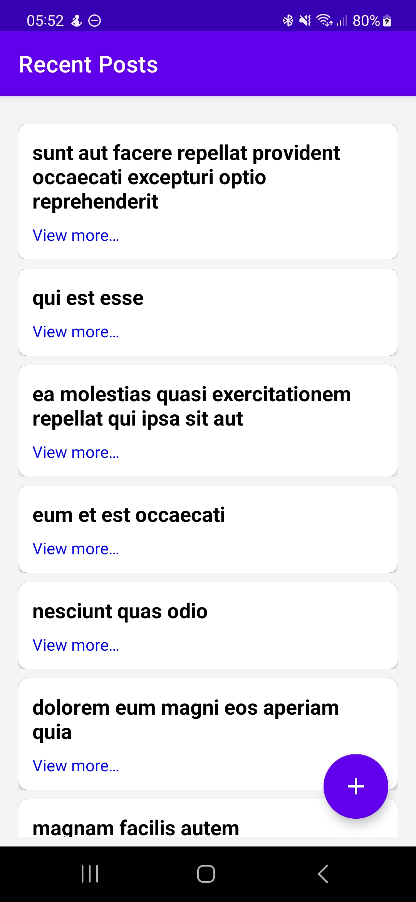
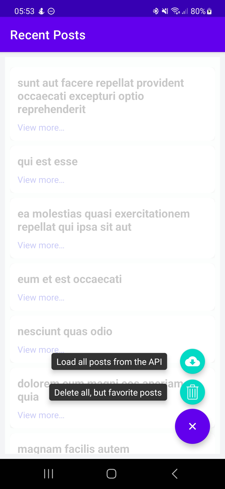

# Posts App
Native Android app developed with [Kotlin](https://kotlinlang.org/), using Posts from [Json Placeholder](https://jsonplaceholder.typicode.com/) as a data source.

<br>

## How to run the App
Clone the proyect using:

```bash

git clone https://github.com/mikedev93/posts-app.git

```

Open the proyect in Android Studio, and once the IDE is done indexing and synchronizing all the files, it'll be ready to run.

<br>

## What it does
The Posts App fetches a paginated list of posts from a server. Each post can be accessed for more details, marked as favorite or deleted from the list.

<br>

## Architecture
I went for a simple MVVM Architecture implementation, mainly because I believe a Clean Architecture approach for a small app is ~~overkill~~ too much.<br>
MVVM achieves everything we need to separate the UI from the business logic. Our code testability is increased and we have an easier package structure to navigate, plus you can add a new feature more quickly.

<br>

## Third party libraries used
- [Jetpack Navigation](https://developer.android.com/guide/navigation)
  <br>Used to navigate between fragments and pass arguments. Does the heavy lifting on handling the fragment backstack.
- [Coroutines](https://developer.android.com/kotlin/coroutines)
  <br>Used for asynchronous operations. Chose this over [RxJava](https://github.com/ReactiveX/RxJava) because of the many extensions that a lot of new libraries provide to fully support it. Practically works out of the box.
- [Dagger Hilt](https://dagger.dev/)
  <br>In my exprience, the best there is (and easier to implement) for dependency injection.
- [Retrofit](https://square.github.io/retrofit/)
  <br>Awesome networking library that needs little to no customization to get it to work right after adding it to gradle. It handles parsing with [Gson](https://github.com/google/gson) in my case.
- [Lottie](https://github.com/airbnb/lottie-android)
  <br>Great library for animations. Used it for the loading animations throughout the app.
- [Expandable FAB](https://github.com/nambicompany/expandable-fab)
  <br>There is no need to reinvent the wheel when you have a high quality component like this. Loved the functionallity, highly customizable.

## Features

**Main Screen**
<br>You can see a list of posts returned by the Service.



<br><br>

**FAB Actions**
<br>By clicking on the Floating Action Button at the bottom you can get **All the posts** from the server, or delete any posts that you haven't marked as favorite.



<br><br>

**Swipe Actions**

| Swipe right to<br> mark a Post as Favorite.<br>Do it again to unmark it | Swipe left to<br> delete a Post |
| :-------------: |:-------------:|
|       |  |

<br><br>

**Post Details**
<br>Details of a post
| Favorite | Regular |
| :-------------: |:-------------:|
|       |  |

<br><br>


## Bucket List

- [x] Load posts from the API and display on Main Screen.
- [x] Create a Post Detail Screen.
- [x] Implement a mechanism to favorite/unfavorite a post.
- [x] Implement a mechanism to delete a post.
- [x] Implement a mechanism to remove all posts, except for the favorite ones.
- [X] Implement a mechanism to load all posts from the API.
- [x] Remote error handling
- [x] Incorporate FRP (Functional Reactive Programming) wherever it makes sense.
- [x] BONUS: Endless Scrolling
- [ ] Write Unit Tests
- [ ] Offline solution to cache data.